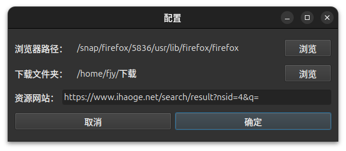
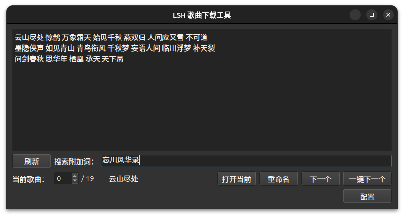
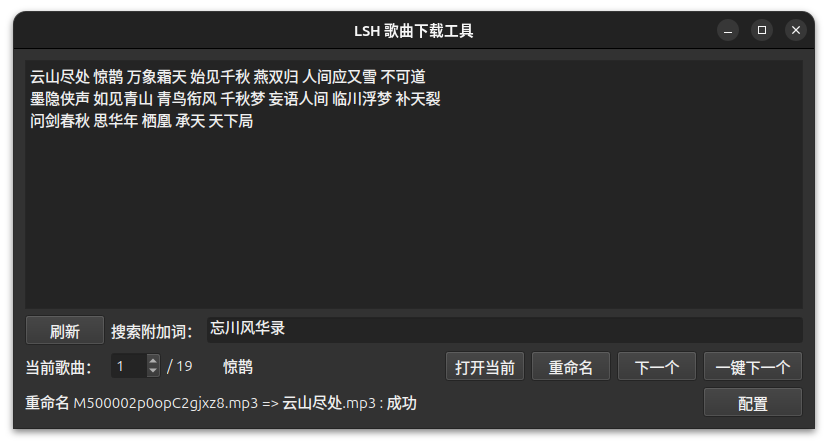
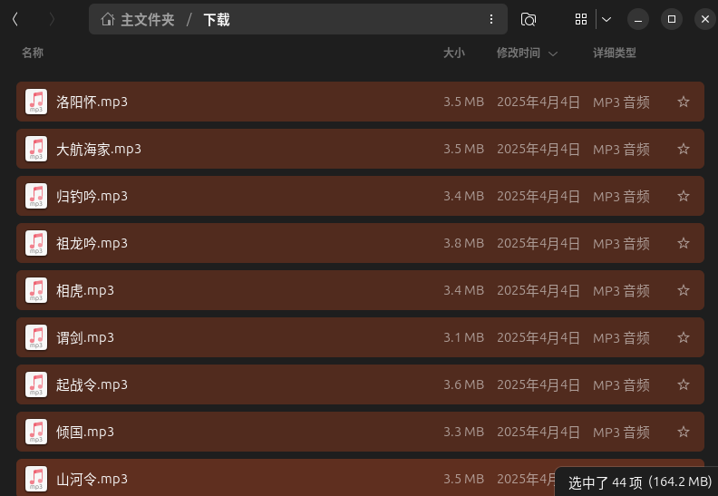

# 🚀 LSH 歌曲下载助手


## 🌟 核心价值

### 🚫 你是否正在经历这些困扰？
- **会员墙**：各大平台下载歌曲需充值 VIP，但**只想收藏几首歌**？
- **效率黑洞**：新入手的 MP3 要装数百首歌，手动下载**耗时长到怀疑人生**？
- **操作割裂**：不断在浏览器/资源站/文件管理器间切换，**键盘鼠标点到手酸**？
- **命名灾难**：下载的文件名乱如 `Track01(1)_final版.mp3`，**整理时两眼发黑**？

### ✨ `LSH 歌曲下载助手` 的自动化革命
**只需三步，解放双手：**
1. 📝 **编写歌单** - 将想下载的歌曲名粘贴进输入框（支持批量粘贴）。
2. 🚀 **自动跳转** - 点击"打开当前"，程序自动生成带精确搜索词的URL，直达资源站。
3. ⚡ **流水作业** - 每完成一首歌的下载，点击"一键下一个"。  
✅ 自动打开下一首的搜索页，填充歌手/专辑等搜索附加词。  
✅ 自动标准化命名，应用命名模板`[歌名].[扩展名]`，生成干净整洁的文件名（如 `七里香.flac`）。

### ⏱ 效率对比
| 传统方式 | LSH助手 | 效率提升 |
|-|-|-|
| 手动输入每个歌名搜索 | 自动填充精准搜索词 | 300%↑ |
| 下载后手动重命名 | 智能命名无需操心 | 200%↑ |
| 频繁切换窗口定位文件 | 后台监控下载目录 | 150%↑ |

### 🎯 精准解决音乐收藏痛点
- **绕过平台限制**：直接从开放资源站获取歌曲，**无需订阅会员**。
- **命名强迫症福音**：自动生成`[歌名].[格式]`的清爽命名。
- **专注核心决策**：您只需在浏览器里 **选择歌曲版本下载**，其他交给程序。

💡 **想象一下**：泡杯咖啡的功夫，程序已协助您整理好 30 首高音质歌曲，整齐排列在MP3中，歌名清爽可读——这就是 `LSH 歌曲下载助手` 带来的下载新体验！

## 🛠 环境配置
```bash
# 克隆仓库
git clone https://github.com/FangJunyi4510/LSH_Song_Download_Tool.git
# 编译准备
sudo apt install build-essential libgl1-mesa-dev
sudo apt install qt6-base-dev qt6-tools-dev-tools
# 编译项目
cmake -B build
cmake --build build
```
## 🎮 使用指南
### 初始配置

首次运行点击 `配置` 按钮

#### 1. 设置浏览器可执行文件路径。
#### 2. 指定浏览器下载目录。
#### 3. 输入资源网站地址（默认已预置）。



### 批量下载流程

1. 输入歌曲列表（歌名用空白字符隔开），点击 `刷新`。

1. 点击 `打开当前`。程序会打开当前歌名的浏览器搜索页面。

1. 在浏览器中选择要下载的歌曲版本，等待下载完成。
1. 点击 `一键下一个`。程序会自动重命名刚刚下载的文件，并打开下一个搜索页面。

1. 循环 3,4 直到结束。


## 📁 文件结构

```
LSH_Song_Download_Tool/
├── CMakeLists.txt          # 构建配置
├── widget.ui               # 主界面布局
├── configuredialog.ui      # 配置对话框
├── widget.h/cpp            # 主逻辑实现
└── configuredialog.h/cpp   # 配置管理
```
## ⚠️ 常见问题
### 编译问题

#### Q: 遇到 Qt 版本不兼容错误怎么办？
```bash
# 查看已安装 Qt 版本
qmake6 --version
# 指定 Qt 路径编译
cmake -B build -DCMAKE_PREFIX_PATH="/opt/Qt6.4.2/gcc_64" # 替换为实际 Qt 路径
```
### 运行时问题
#### Q: 为什么文件会重命名失败？为什么有时被重命名的文件不合预期？
重命名时，程序会选择下载文件夹中修改时间最晚的文件（通常即为刚刚下载的为歌曲文件）。若在下载文件夹中有新被修改的文件，可能会干扰到程序的选择。
重命名失败的可能原因如下：
1. 有同名文件存在（可能文件已经被重命名）。
1. 目标文件正在被占用（可能没有下载完成）。
1. 没有写权限。（可能下载目录权限要求过高）。

## 📜 开源协议

本项目采用 GNU GPLv3 协议开放源代码，您可以在遵循以下条款的前提下：

1. 自由使用和修改代码
1. 需保留原始版权声明
1. 二次分发必须采用相同协议

更多细节请参阅 LICENSE 文件。

## 🙋 支持与贡献

遇到 Bug，请提交 Issue 至 [GitHub Issue 页](https://github.com/FangJunyi4510/LSH_Song_Download_Tool/issues)。给您带来了不便，我们深表歉意！

贡献者：[@FangJunyi4510](https://github.com/FangJunyi4510/)

感谢所有默默帮助 `LSH 歌曲下载助手` 改进的间接贡献者们！你们的贡献尽管大多鲜为人知，但是对我们不可或缺！
